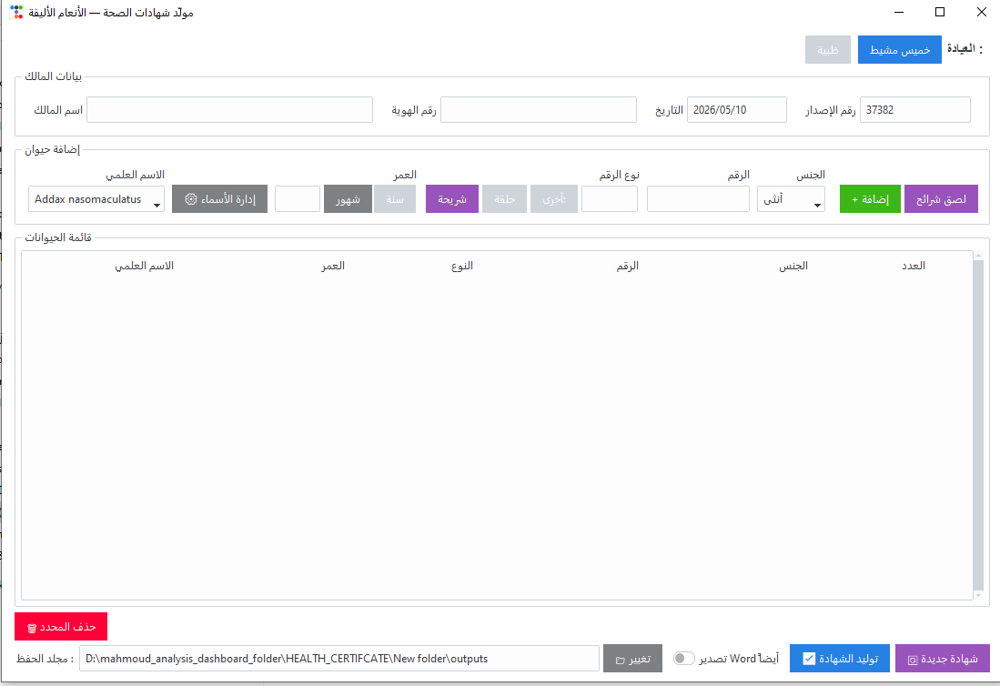
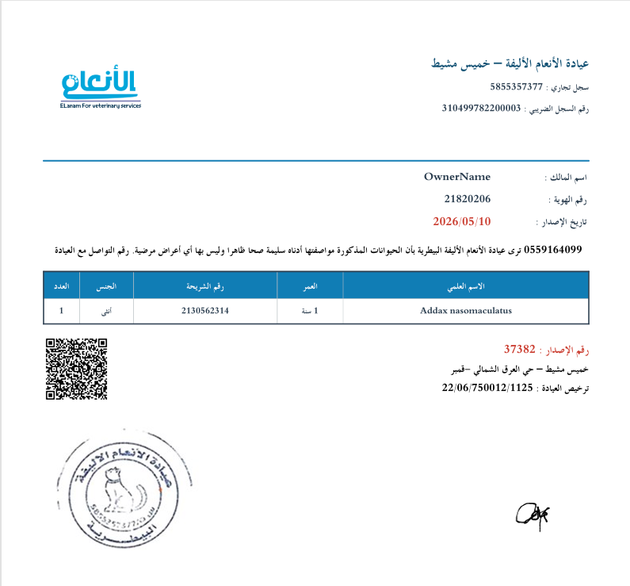

# 🩺 Veterinary Certificate Generator – El-Anam Clinic

A bilingual (Arabic/English) desktop application for generating **health certificates** for animals, designed for **El-Anam Veterinary Clinic** (branches: Khamis Mushait & Dhahbia). Built with Python, `ttkbootstrap`, `reportlab` (PDF), and `python-docx` (Word).



---

## ✨ Features

- **Two clinic profiles** – each with its own stamp, trade register, tax ID, license, and address.
- **Per‑animal identification** – chip number, ring number, or custom ID type.
- **Scientific name manager** – add/remove/edit species list (persisted to JSON).
- **Mass import** – paste a list of chip numbers with gender distribution.
- **PDF generation** – correctly rendered Arabic (using `arabic_reshaper` + `bidi`), includes clinic stamp, signature, and optional QR code.
- **Word export** – produces a `.docx` file (no images for stamp/signature yet, but ready to extend).
- **Archival copy** – automatically saves a PDF copy inside `outputs/output_isdar/` named by serial number.
- **Clipboard shortcuts** – Ctrl+A/C/V/X work in all entry fields.

---

## 🖥️ Demo




---

## 📦 Requirements

- Python 3.8 or higher
- Windows / Linux / macOS (tested on Windows 10)

Install dependencies:

```bash
pip install -r requirements.txt
